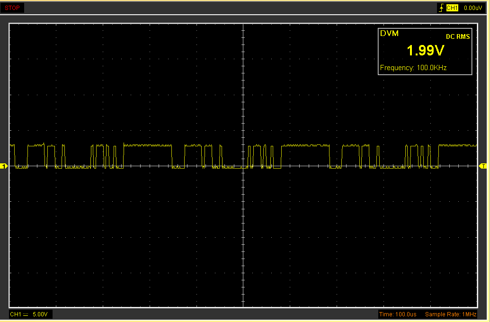
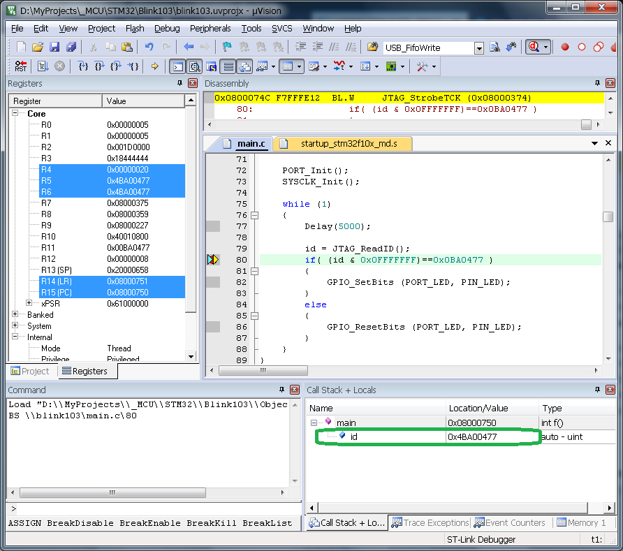

### Blink103 - is a simple firmware for on-board ST-Link debugger for **MDB1986 development board** based on STM32F103 or CS32F103 MCU.
It sends JTAG IDCODE sequence to the main MCU (MDR1986VE1T) and reads the reply. When the reply is a valid Cortex-M IDCODE it flashes the led.

[The Keil uVision 5 IDE](https://keil.com) was used to create and debug this project.
[The SPL (Standard Peripheral Library)](https://www.st.com/en/embedded-software/stsw-stm32054.html) 3.5.0 is required to build this project.
>Connection schematics is similar to any ST-Link clone and can be found in top folder.

### JTAG IDCODE reply on oscilloscope 

### Debug session in Keil uVision IDE

:smile:

[GitHub readme tips&tricks](https://help.github.com/articles/basic-writing-and-formatting-syntax/)

