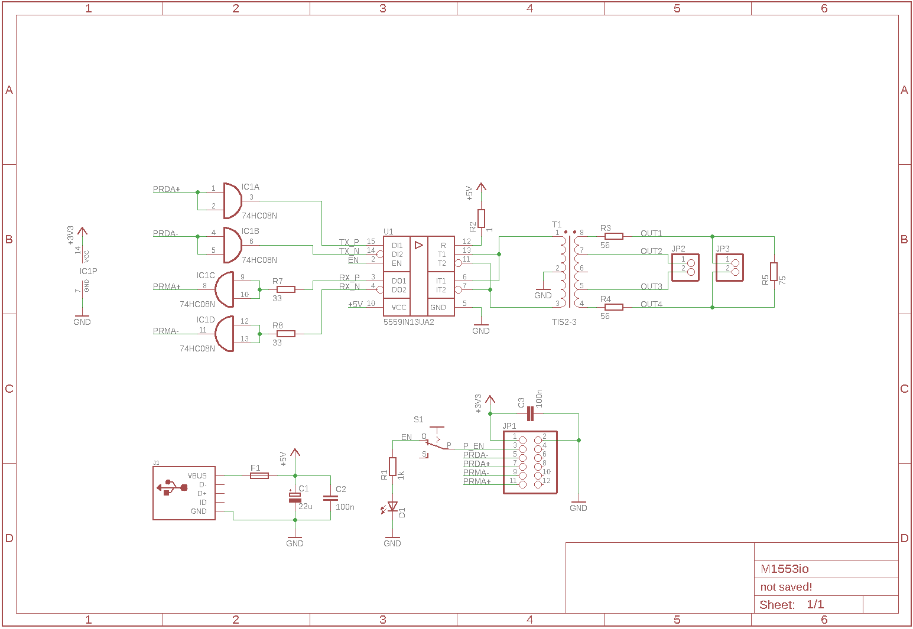

# M1553io - MIL_STD_1553 input/output shield for MDB1986 Development Board.

This is a simple adapter for connecting the MDB1986 board to the MIL_STD_1553 bus.
It is based on the 5559UH13YA transciever chip by NPO "Physica". This component and transformer can be found in the 5559.lbr file.

##### The adapter board:

##### The adapter schematics:

### TODO :pen:
- [ ] Use small package for 74xxx ICC as a level-shifter;
- [ ] P_EN pin should be pulled-down (or up);
- [ ] Check the length of the transformer pins;
- [ ] Add check-points (pin) for Logic-Analyzer;
- [ ] Place all components on the new Development Board;
