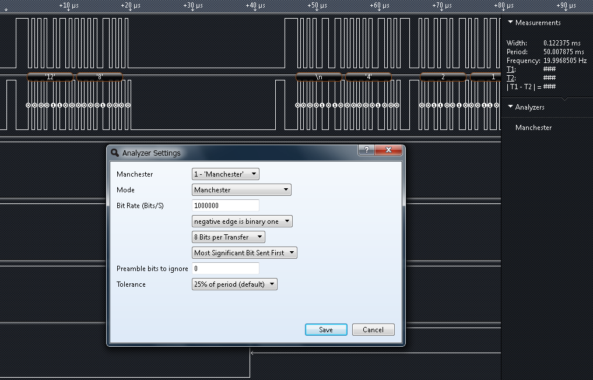

## M1553 - MIL_STD_1553 simple input/output demonstration firmware for my MDB1986 board.
> Platform: Milandr MCU K1986BE1QI.

C-style source code (temporary).

### Manchester code of the test I/O sequence on a low-cost Saleae Logic analyzer.

## TODO :pen:
- [x] Logic Analyzer setup & configure
- [x] BC init :+1:
- [x] Flood test sequence
- [ ] Check for status & errors
- [ ] RT init
- [ ] IRQ handler
- [ ] Add required commands
- [ ] Reply StatusWord
- [ ] Send/Recv Vector word
- [ ] Transfer echo/test data
- [ ] Transfer any data
- [ ] Publish articles!

