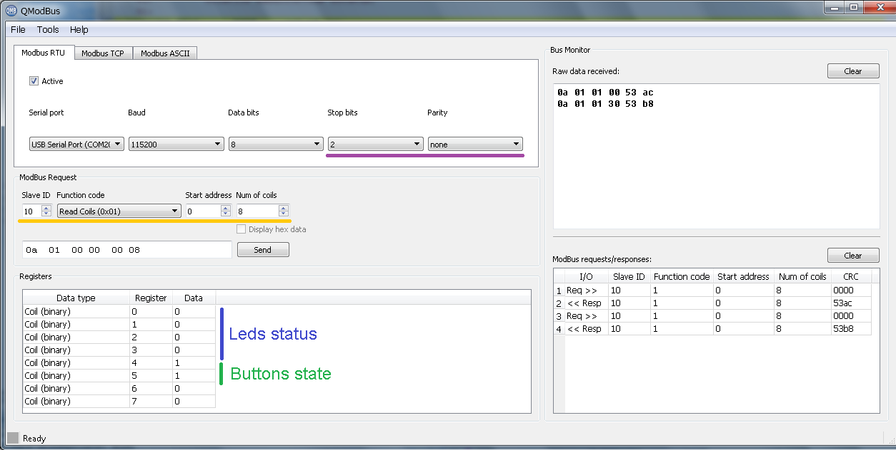
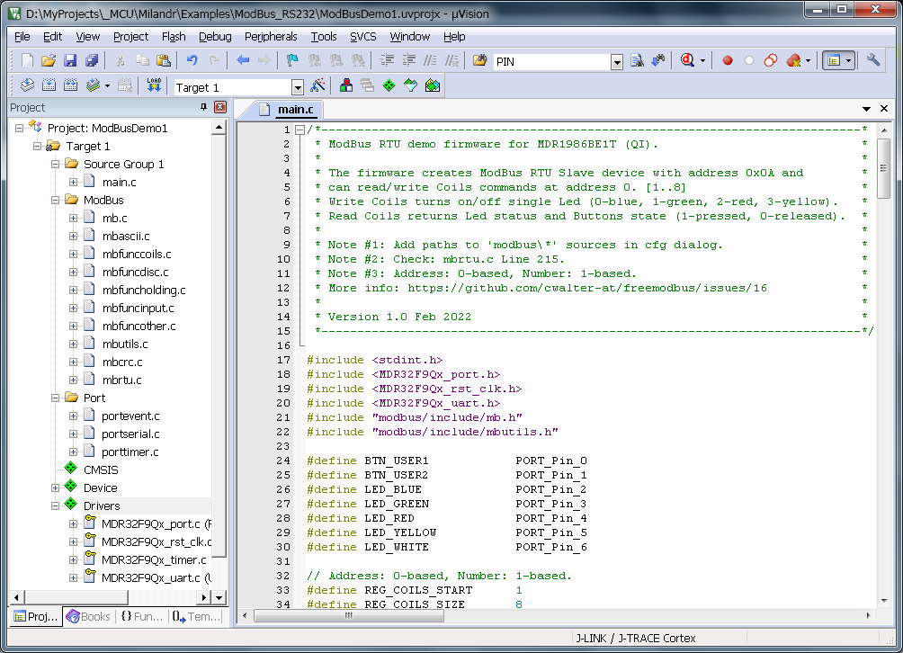

## ModBus_RS232 - FreeModBus RTU Slave demonstration firmware for Milandr 1986BE1T (QI) board.
> Platform: Milandr MCU K1986BE1QI.

The source code is based on the [freemodbus library](https://github.com/cwalter-at/freemodbus) by Christian Walter.

### Important note: Add call to "xMBRTUTransmitFSM ();" in mbrtu.c file, Line 215.

This Demo firmware runs at 80MHz and uses UART#2 (Port_D 13, Port_D 14) and Timer #1 with prescaler set to 8.
UART is configured to 115200 baudrate, parity none, 2 stop bits (as recommended by the Standard).
When a button (#1 or #2) is pressed its status is written to the Coils register ucRegCoilsBuf[0], bits 4 and 5.
Color leds can be turned on and off by setting Coils register bits: 0 - blue, 1 - green, 2 - red, 3 - yellow.
Holding registers simply store predefined values: { 0, 1, 2, 3, 4, 5, 6, 7 }.

### Slave address is set to 0x0A (10 decimal).

The project folder contains **modbus** subfolder and the MCU specific **port_1986BE1T**.

##### Good luck! 😏
