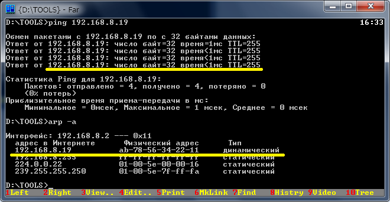

## Ping - ethernet example to test that hardware is functional.
> Platform: Milandr MCU K1986BE1QI.

The source code is based on the SPL example from Milandr software pack.

### Windows ping utility output.

##### Good luck!
