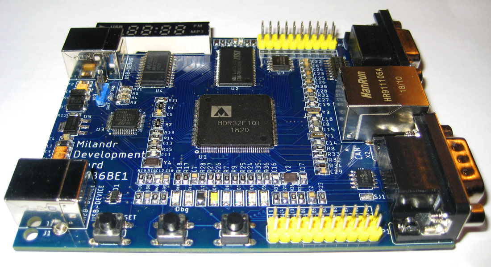

## MDB1986 - Milandr Development Board for [K1986BE1QI MCU (package LQFP-144)](https://ic.milandr.ru/products/mikrokontrollery_i_protsessory/32_razryadnye_mikrokontrollery/1986vekh_avia/k1986ve1t/).
> This is an open source hardware project for tutorial purposes.

The PCB was designed in the Eagle CAD 9.0.

The [`Blink103`](Blink103) folder contains firmware for on-board debugger MCU (STM32F103). It can be used to test debugger curcuit and target MCU with JTAG IDCODE instruction. Project files were created with the [Keil uVision MDK](https://www.keil.com/demo/eval/arm.htm). The board schematics can be found in [`MDB1986-Schema.png`](MDB1986-Schema.png) file.

### MDB198 Development Board :cool:

## TODO :pen:
- [x] Solder the board :+1:
- [x] Download debugger firmware
- [x] Install [MDR Library Pack](https://ic.milandr.ru/soft/)
- [ ] Build and run Demo test
- [ ] Publish articles!

[GitHub readme tips&tricks](https://help.github.com/articles/basic-writing-and-formatting-syntax/)

